** THIS IS AN INSPIRATION OF THE ARCHITECTURE WITH S3CMD

see: https://www.pluginsandsnippets.com/downloads/s3cmd-bucket-backup-script-for-digitalocean-spaces-amazon-s3/

S3cmd Bucket Backup Script for DigitalOcean Spaces & Amazon S3
==============================================================

### S3cmd Bucket Backup Script Highlights:

*   Bash script to be installed via SSH on any Linux Server
*   Backups for DigitalOcean Spaces, Amazon S3
*   Backup in second account/region
*   Uses S3cmd library
*   Daily, Weekly, and Monthly Full Backups
*   Manages Backup Rotation/Lifecycle
*   Test and Production Modus
*   Restore to bucket on new account/region possible
*   User-friendly menu

[Documentation](https://www.pluginsandsnippets.com/knowledge-base/s3cmd-bucket-backup-script-documentation/)

The following video explains how this backup script works:

Our S3cmd Bucket backup script uses the Secure Shell Protocol (SSH) and the [S3cmd](https://s3tools.org/s3cmd) library to manage the daily backups of a Bucket from one account in DigitalOcean Spaces or Amazon S3 to a second separate account. The script uses a unique sequence of calling S3cmd commands to sync two buckets from different Amazon S3 or DigitalOcean Spaces accounts.

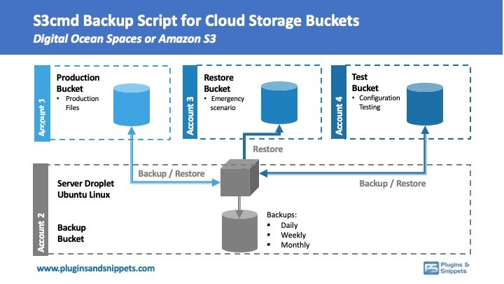

**What Problems does the S3cmd Bucket Backup Script solve?**
------------------------------------------------------------

**Problem 1:** The standard S3cmd library was made to access primarily one account in DigitalOcean Spaces or Amazon S3 but does not come with an easy solution to create a backup from a bucket in one account to a second account in DigitalOcean Spaces or Amazon S3.

**Problem 2:** The standard way to take backups of Cloud Storage Buckets is by syncing a bucket to another. The problem is that you need to spend days developing your own script if you are looking to create daily backups as per a specific point in time for certain restore scenarios.

**The Solution offered by S3cmd script:** The S3cmd bucket backup script manages daily, weekly and monthly backups of Production Bucket to Backup bucket, as well as restore scenarios to Production, Restore or Test Buckets.

The bucket backup solution will create Daily, Weekly, and Monthly folders in the backup bucket. The backup script will fill the folders with exact replicas of the Production Bucket as per the applicable backup dates.

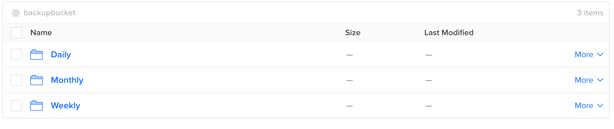

Each backup will have its folder, which is labeled in YYYYMMDD\_HHMMSS format.

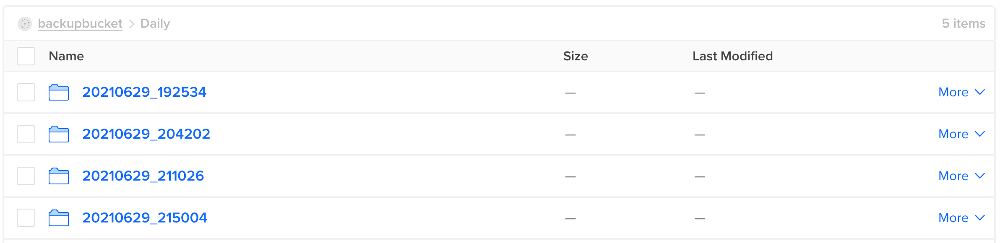

**Requirements:**
-----------------

*   Linux Server (e.g., a Droplet in DigitalOcean with Ubuntu)
*   Account 1 in DigitalOcean Spaces or Amazon S3 containing a Production bucket
*   Account 2 in DigitalOcean Spaces or Amazon S3 (containing a Backup bucket)
*   S3cmd library

**Optional**

*   Account 3 in DigitalOcean or Amazon S3 (for Test Bucket)
*   Account 4 in DigitalOcean or Amazon S3 (for Restore Bucket in case Production Bucket would be compromised)

The S3cmd bucket backup script needs to be installed on the Linux server via SSH.

**Script Main Menu:**
---------------------

Once the bucket backup script is installed, the user can access a menu via (by entering the sh menu.sh command in the respective folder). This will open a menu via the command to manage the whole configuration to manage backups and restores for DigitalOcean Spaces bucket or an Amazon S3 bucket. The offered menus are the following:

(01) Create Backup                                               (productionbucket => backupbucket)

(02) Restore to PRODUCTION Bucket            (backupbucket => productionbucket)

(03) Restore to RESTORE Bucket                    (backupbucket => restorebucket)

(04) Restore to TEST Bucket                           (backupbucket => testbucket)

**Backup Bucket:**

(05) List Buckets in Backup Account

(06) List Backups in Backup Bucket backupbucket

**Configuration and Setup:**

(07) Change Modus: Test/Live (Current Modus: production)

(08) Set Backup Period (Lifecycle Policy)

(09) Set API Settings

(10) Check API Connections

(11) Make Restore New Production Bucket

(12) Update s3cmd Library

(13) Set Folders Daily/Weekly/Monthly

(14) Set Cronjobs

(15) Set Timezone

(16) Closing Ports

(17) Quick Setup

**Documentation**

(18) View READ.md

**Menus 1-4** offer quick actions to do an ad-hoc backup or restore any backups to the Production, Restore, or Test bucket.

**Menus 5-6** offers access to view the contents of the backup account, its buckets, and the available backups in the Backup folder.

**Menus 7-17** allow making configuration changes, setting cronjobs, the server’s time zone, changing from Production to Test Modus, setting the archiving period for Daily, Weekly, and Monthly backups.

**Menu 18** contains a README.md documentation file which will open in SSH.

**Script Screenshots**
----------------------

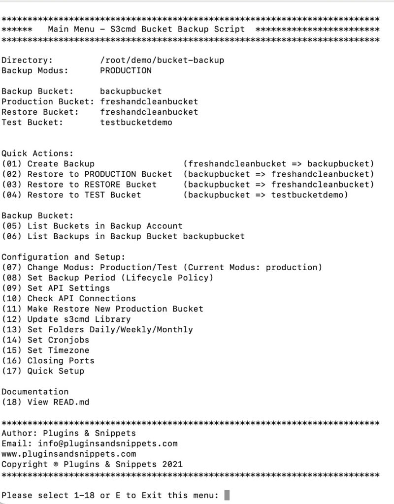

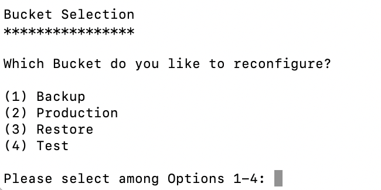

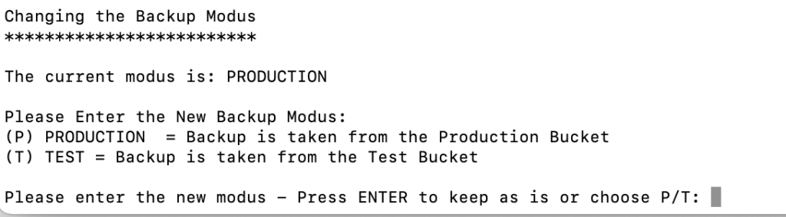

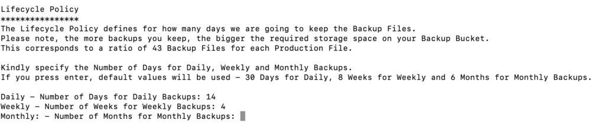

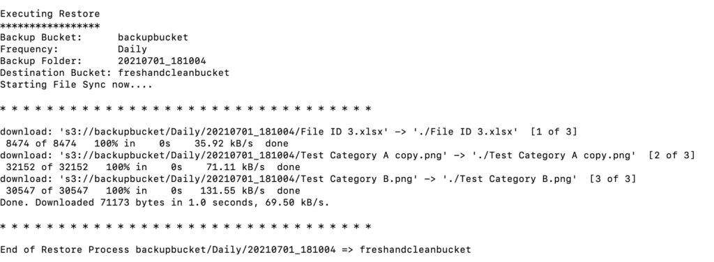

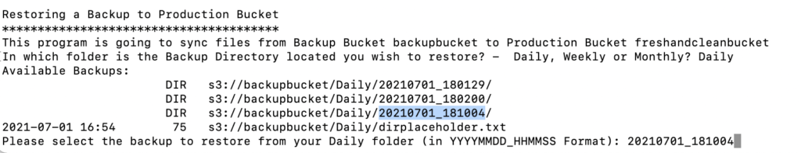

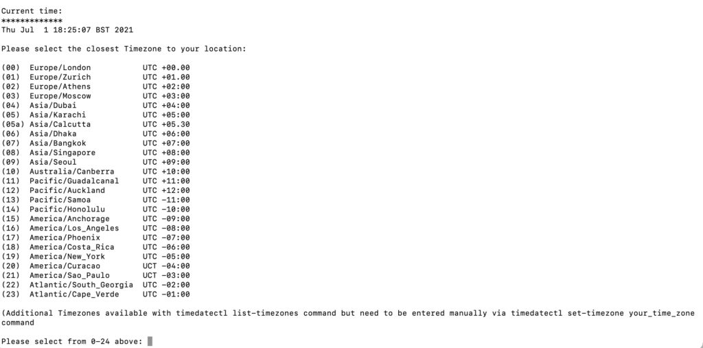

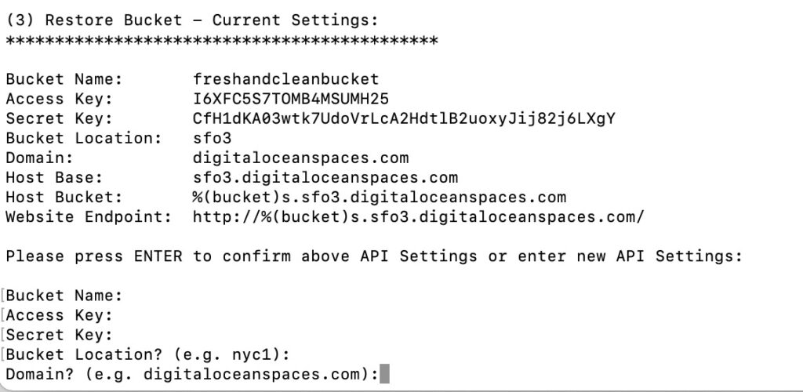

**Why do you need a bucket-backup script?**
-------------------------------------------

To summarize, here are the main reasons why the S3cmd backup script is a good choice:

*   Keeps exact complete copies of your buckets
*   Benefit from easy access to Daily, Weekly, Monthly Backups
*   Backup possible to bucket on second account/region
*   Script installed on your server, no dependencies on anybody else
*   Uses S3cmd library, one of the most established libraries for managing cloud storage buckets
*   Supports DigitalOcean Spaces to Amazon S3 and vice versa
*   User-friendly menu via SSH, which can trigger restore actions quickly
*   Quick setup and configuration
*   Test and Production Modus
*   Restore possible on fresh accounts (by defining the Restore Bucket)